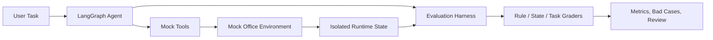
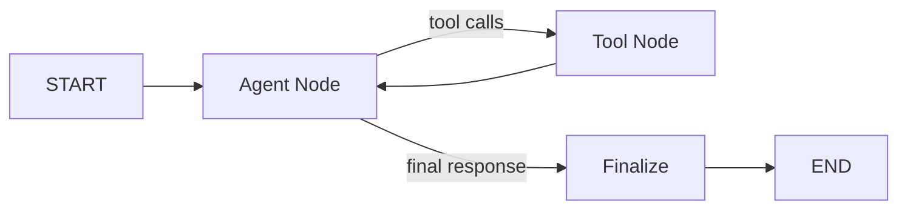

# 项目架构图

## 1. Overall Architecture

```mermaid
flowchart LR
    T[User Task] --> A[LangGraph Agent]
    A --> MT[Mock Tools]
    MT --> E[Mock Office Environment]
    E --> S[Isolated Runtime State]
    A --> H[Evaluation Harness]
    S --> H
    H --> G[Rule / State / Task Graders]
    G --> M[Metrics, Bad Cases, Review]
```

## 2. Agent Loop

```mermaid
flowchart LR
    START --> AgentNode[Agent Node]
    AgentNode -->|tool calls| ToolNode[Tool Node]
    ToolNode --> AgentNode
    AgentNode -->|final response| Finalize[Finalize]
    Finalize --> END
```

## 3. Evaluation Lifecycle

```mermaid
flowchart LR
    Design[Task Design] --> Static[Static Validation]
    Static --> Env[Environment Construction]
    Env --> Run[Agent Run]
    Run --> Capture[State Capture]
    Capture --> Grade[Auto Grading]
    Grade --> Review[Review]
    Review --> Bad[Bad Case / Regression]
    Bad --> Freeze[Freeze]
    Freeze --> Formal[Formal Blind Eval]
```
